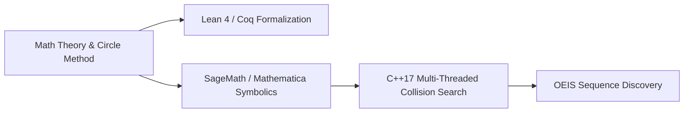

# 🧩 Unsolved Status: Erdős Problem #979

> **Status:** Open Problem for $k \ge 4$  
> **Source:** Erdős [Er65b, p. 224], [erdosproblems.com/979](https://www.erdosproblems.com/979)

---

## 📌 Problem Formulation

Let $k \ge 2$. For any positive integer $n$, let $f_k(n)$ denote the number of distinct representations of $n$ as the sum of $k$ prime $k$-th powers:

$$n = p_1^k + p_2^k + \dots + p_k^k, \quad \text{where } p_1 \le p_2 \le \dots \le p_k \text{ are prime numbers.}$$

### ❓ Main Question
Is it true that for every $k \ge 2$:

$$\limsup_{n \to \infty} f_k(n) = \infty$$

That is, for any integer $M > 0$, does there exist an integer $n$ that can be represented as a sum of $k$ prime $k$-th powers in more than $M$ distinct ways?

---

## 📊 Status Matrix

| Case | Status | Discovered / Proven By | Notes & Record Collisions |
| :--- | :--- | :--- | :--- |
| **$k = 2$** | **PROVEN** ✅ | Paul Erdős (1937) | $\limsup f_2(n) = \infty$. Max in search: $f_2(9,549,410) = 13$. |
| **$k = 3$** | **UNPUBLISHED / OPEN** ⚠️ | Paul Erdős claimed [Er65b] | Proof never published. StijnC (2025) found $f_3(10,588,881,419) = 5$ ([OEIS A385316](https://oeis.org/A385316)). |
| **$k = 4$** | **OPEN** ❌ | Unsolved | First record $f_4(141,339,844) = 3$ found; expanded to $f_4(92,797,231,684) = 3$. |
| **$k \ge 5$** | **OPEN** ❌ | Unsolved | Density $\mathbb{E}[f_k(n)] \to 0$ rapidly as $k$ grows. |

---

## 🔬 Key Computational Findings from this Repository

Using our multi-threaded C++17 solver (`cpp/erdos979.cpp`), we established the following state-of-the-art computational collision points:

### 1. Case $k = 2$ ($p \le 5000$)
* **Max Collision Count**: $f_2(9,549,410) = \mathbf{13}$
* **Collision Distribution**: 26 numbers with $f_2(n)=8$, 6 numbers with $f_2(n)=11$, 1 with $f_2(n)=13$.

### 2. Case $k = 3$ ($p \le 1500$)
* **Max Collision Count**: $f_3(999,979,163) = \mathbf{4}$
* **OEIS Record**: StijnC (2025) found $f_3(10,588,881,419) = \mathbf{5}$ via sum of 3 prime cubes.

### 3. Case $k = 4$ ($p \le 500$)
* **Max Collision Count**: $f_4(92,797,231,684) = \mathbf{3}$
* **Triple Representations**:
  $$7^4 + 239^4 + 421^4 + 491^4 = 92,797,231,684$$
  $$89^4 + 229^4 + 409^4 + 499^4 = 92,797,231,684$$
  $$157^4 + 227^4 + 421^4 + 491^4 = 92,797,231,684$$

---

## 🧠 Why is Erdős #979 Hard to Prove Mathematically?

1. **Density Sparsity**:
   The number of primes up to $N^{1/k}$ is $\pi(N^{1/k}) \sim \frac{N^{1/k}}{\frac{1}{k} \ln N}$.
   The total number of $k$-tuples of primes is roughly:
   $$\sim \frac{N}{(k! \ln^k N)}$$
   On average, a random integer $n \le N^k$ is represented $\mathbb{E}[f_k(n)] \to 0$ times as $k \ge 3$. Thus, collisions are **extreme tail events**, not average behavior.

2. **Modular Residue Obstructions**:
   For $k = 4$, $p^4 \equiv 1 \pmod{240}$ for almost all primes $p \ge 7$. This restricts candidate sums $n$ to arithmetic progressions $n \equiv 4 \pmod{240}$, concentrating collisions into narrow residue classes.

3. **Requirements for Resolution**:
   - **Hardy-Littlewood Circle Method**: Requires bounding minor arcs and proving positivity of the Singular Series $\mathfrak{S}(n)$.
   - **Formal Theorem Proving**: Utilizing interactive proof assistants like **Lean 4** or **Coq** with formalized analytic number theory libraries.

---

## 🛠️ Stack for Approaching Open Erdős Problems

---

## 📜 References
- P. Erdős, *On the representation of integers as sums of prime powers*, [Er65b, p. 224].
- Erdős Problems Portal: [erdosproblems.com/979](https://www.erdosproblems.com/979)
- OEIS Sequence: [A385316](https://oeis.org/A385316) — Minimal $n$ with $\ge r$ representations as sum of 3 prime cubes.
